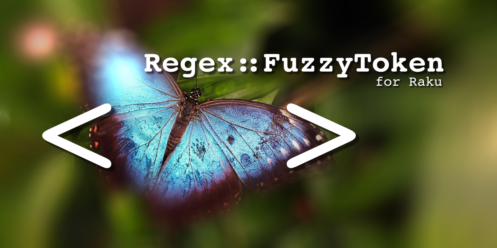

A Raku module enabling the use of fuzzy tokens in regexen and grammars:

    use Regex::FuzzyToken;
    my @fruits = <apple banana mango orange kiwi>;
    "My favorite fruit is a bnana" ~~ /My favorite fruit is a <fuzzy: @fruits>/;
    say $<fuzzy>.fuzz; # bnana
    say $<fuzzy>.Str;  # banana

Support for more flexible capturing options is forthcoming.  The signature for
the fuzzy token are the following:

    fuzzy(*@words,
          :$i  = False,
          :$m  = False,
          :$ws = True,
          :$q  = 33,
          :$capture = (@words.tail ~~ Regex
                         ?? @words.tail
                         !! /\w+/ )
    )

Basically, you should provide a list of strings to be the “goal” words you want to find,
but will accept if they're slightly misspelled.  The `i`, `m`, and `ws` options mimic
the regex matching behavior, and will make comparisons ignore differences in case (**i**),
marks (**m**) or white space (**ws**).  The `q` option is the minimum Q-gram score desired to
allow for a match.  The default of 33 is fine for most cases, but through testing you
may find it necessary to increase or decrease the sensitivity (100 = only match exact,
0 = match everything).

The final option of :$capture allows you to specify the capture regex to use.  By
default it will only capture a sequence of word characters, but that will cause
problems if you need it to match spaces/apostrophes.  While you *can* make things
explicit with `:capture(/foo/)`, the signature was designed to allow you to
specify the final item as the capture regex, and so the following are equivalent:

    <fuzzy: @foo, /bar/>
    <fuzzy: @foo, :capture(/bar/)>

# To do

It could be interesting to allow for a more complex capture, for example, that
matches only as many characters as it needs using `.match($capture, :exhaustive)` on a
substring from the current `.pos`.   That would require some tuning of the Q gram algorithm
and in many cases could take exponentially more time, but would be more accurate / usable.

# Licenses

All code is and documentation is licensed under the Artistic License 2.0, included with
the module.  The image used on Github is based on
[this butterfly](https://www.piqsels.com/en/public-domain-photo-frbsj)
which is licensed under CC-0 and modified in accordance with that license and released
under [CC-BY 4.0](https://creativecommons.org/licenses/by/4.0/)